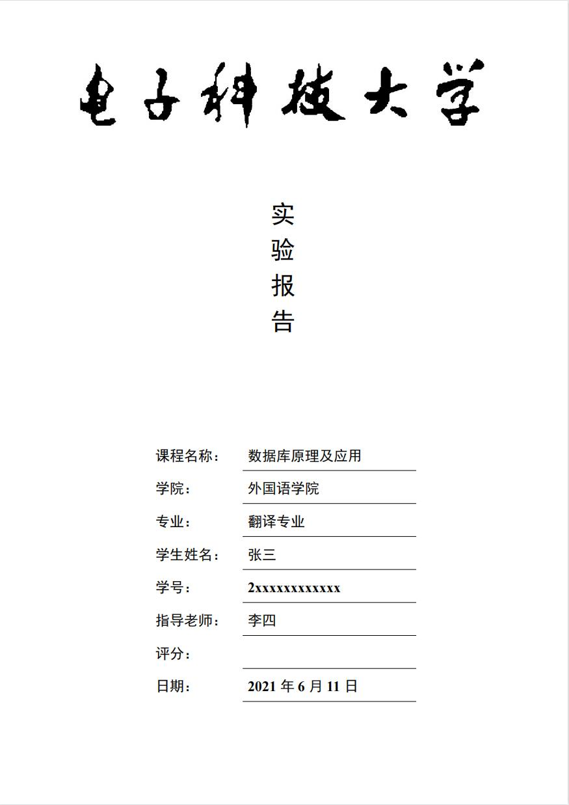
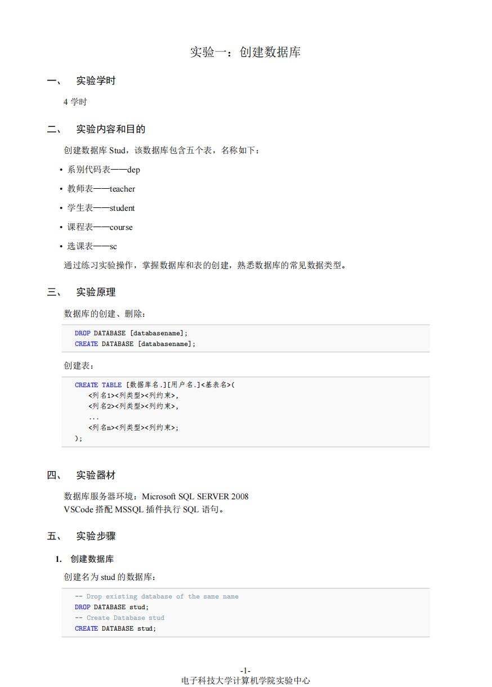
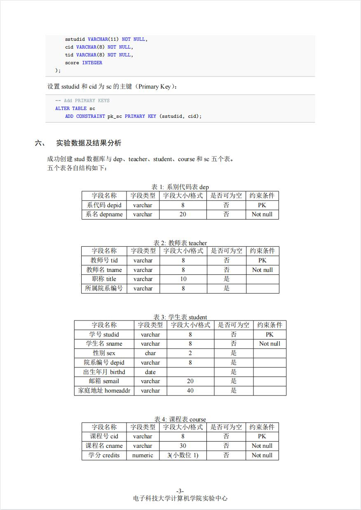
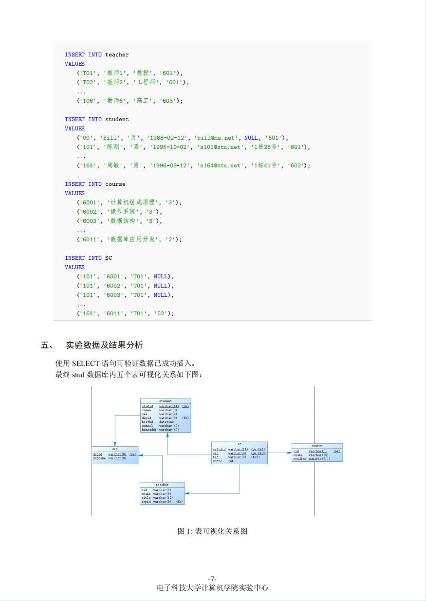

# LaTeX-UESTC-Report

​			

LaTeX template for report(Lab) of University of Electronic Science and Technology of China (UESTC).

# 电子科技大学本科实验报告 LaTeX 模板

这是一个适用于电子科技大学本科实验报告的 LaTeX 模板，基于[zju-report-latex-template](https://github.com/megrxu/zju-report-latex-template)修改制作。

## 使用方法

简易：

```sh
xelatex report.tex
```

要使用该模板，你需要拷贝`uestcreport.cls`文件复制到你的工程目录下，并指定以下：

```tex
\documentclass[a4paper]{uestcreport}
```

为文档模板。

这个模板包含一个内建的封面，可以使用

```tex
\makecover
```

命令来调用内建的封面。

为了能够正确地编译，需要有以下字体

```
SimSun 宋体
SimHei 黑体
KaiTi 楷体
Times New Roman
```


## 示例

这里是用这个模板编出来的一个pdf文档，[点击查看](report.pdf)。









## 注意事项

由于水平有限，本人不保证模板的效果与学校要求 100% 符合。
